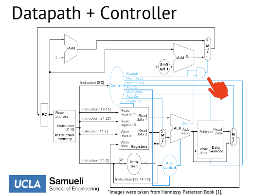

## Objectives
In this project, I completed a RISC-V single-cycle processor that is able to understand and properly handle R-type, I-type, S-type, and B-type instructions.
## Architecture

## Compiling
The program takes 1 required argument and 1 optional argument. The required argument (argv[1]) is the file containing machine code for assembly instructions, and the optional argument is printing options for register values (-d1), memory contents (-d2), or both (-d3).

The instructions are fetched, at which point the controller signals are set based on the fetched instruction's opcode, and next sent to be decoded. After an instruction is decoded, the register file for the CPU is set and the ALU decides what operation needs to take place. If need be, results are written back to either memory or the register file based on index.
